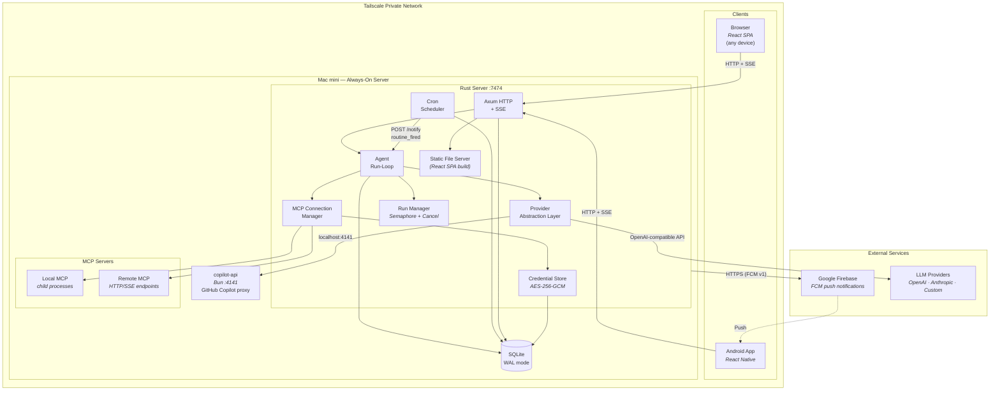
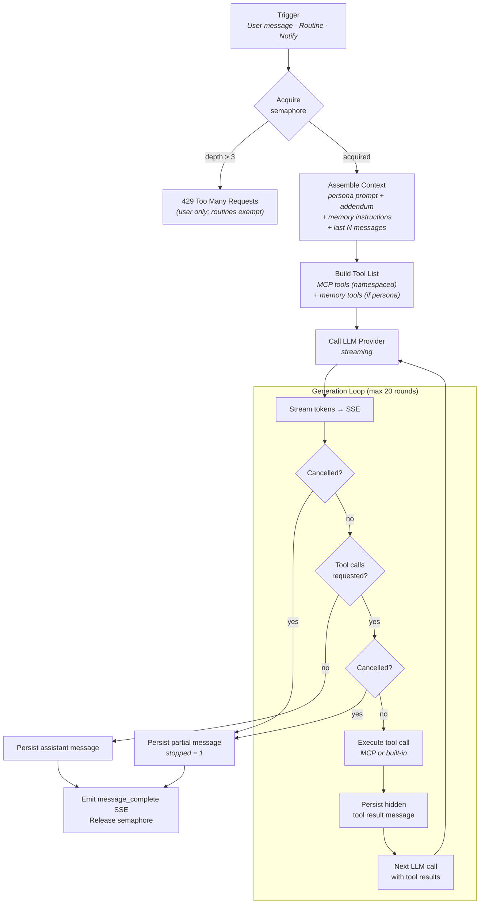
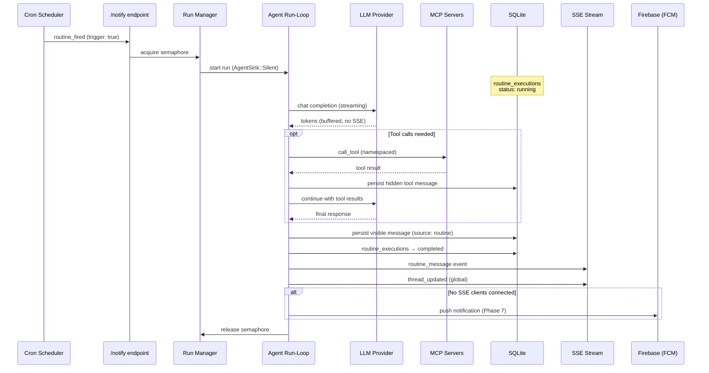
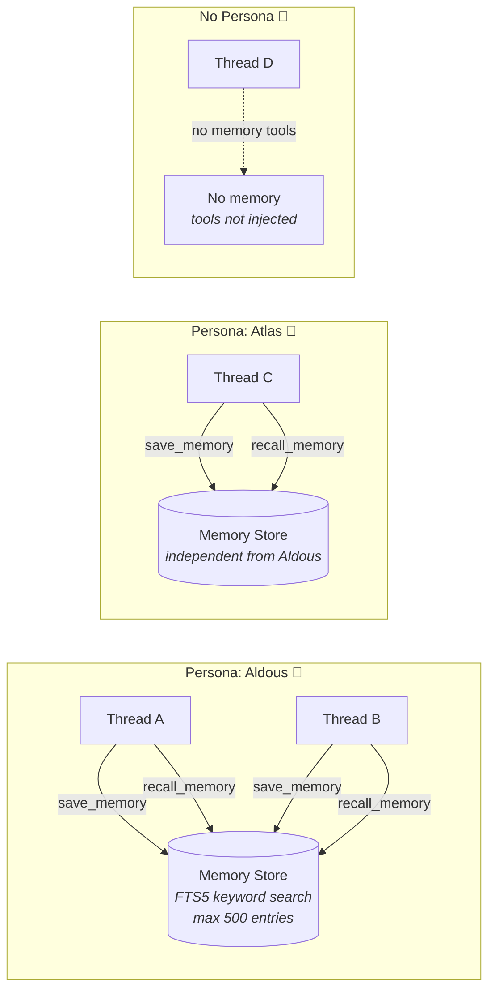
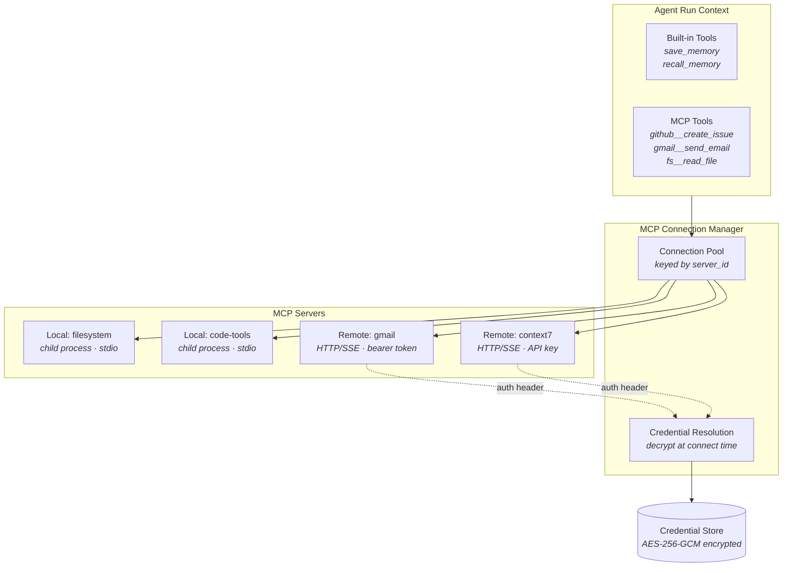

# Agent-Deck — System Architecture

## System Overview



## Agent Run-Loop Detail



## Data Flow — Routine Execution



## Memory System



## Shared State (`Arc<AppState>`)

All route handlers and the auth middleware receive the application state via Axum's `State` extractor. Axum **clones** the state on every request, so the state type must be `Arc<AppState>` — not a bare `AppState` struct.

### Why `Arc` is required

| Field | Type | Sharing mechanism |
|---|---|---|
| `pool` | `SqlitePool` | Internally `Arc`-based — safe to clone |
| `run_states` | `DashMap<String, Arc<RunState>>` | `DashMap::clone()` is a **deep copy** — without `Arc`, each request gets its own disconnected map |
| `thread_senders` | `Arc<Mutex<HashMap<…>>>` | Explicitly `Arc`-wrapped |
| `global_tx` | `broadcast::Sender` | Reference-counted internally |
| `built_in_tools` | `Arc<Vec<…>>` | Explicitly `Arc`-wrapped |
| `auth_token` | `Arc<RwLock<String>>` | Must be readable by every request **and** writable by `rotate_token` |
| `mcp`, `copilot` | internally `Arc`-based | Safe to clone |

Without `Arc<AppState>`, the `run_states` DashMap deep-clones on every request, meaning the `RunState` inserted by a `POST /messages` handler (which registers the running turn) is **never visible** to `POST /cancel` — cancellation silently fires into a disconnected copy of the map.

### `auth_token: Arc<RwLock<String>>`

The auth middleware compares incoming Bearer tokens and session cookies against `state.auth_token`. The `POST /auth/token/rotate` endpoint generates a new token, persists it to the database, **and** writes it back through the `RwLock` so the middleware immediately enforces the new token without a server restart:

```rust
// routes/auth.rs — rotate_token
let new_token = auth_service::rotate_auth_token(&state.pool).await?;
*state.auth_token.write().unwrap() = new_token.clone();
```

### Router setup

```rust
// routes/mod.rs — build_router
let state = Arc::new(AppState { … });

let protected_api = Router::new()
    // … routes …
    .layer(middleware::from_fn_with_state(state.clone(), auth_middleware));

let app = Router::new()
    .merge(public_api)
    .merge(protected_api)
    .with_state(state);   // Arc clone — cheap reference-count bump
```

Every handler signature uses `State<Arc<AppState>>`. Helper functions that only need a read reference accept `&AppState`; Rust's `Deref` coercion from `&Arc<AppState>` to `&AppState` means call sites need no changes.

## MCP Integration


