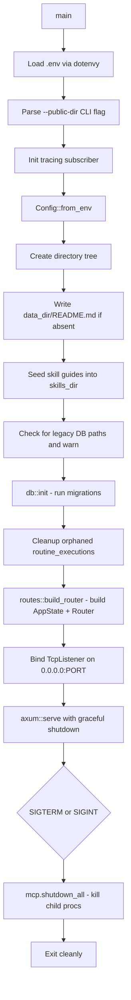

# 01 — Startup and Configuration

## Server Entry Point: `main.rs`

`main.rs` is lean by design. It orchestrates startup but contains no business logic. Here is the exact sequence:



### Notable startup details

**Orphaned execution cleanup (line ~100):**
```sql
UPDATE routine_executions
SET status = 'failed', error = 'server restarted during execution'
WHERE status = 'running'
```
This runs before the router is built. Any routine that was mid-execution when the server last crashed gets marked failed so the UI doesn't show phantom "running" states.

**Skill guides are always overwritten:**
```rust
const SKILLS: &[(&str, &str)] = &[
    ("credentials.md", include_str!("../../docs/skills/credentials.md")),
    ("webhooks.md", ...),
    ...
];
for (filename, content) in SKILLS {
    tokio::fs::write(config.skills_dir.join(filename), content).await?;
}
```
These are embedded at compile time via `include_str!`. They overwrite on every startup so they stay in sync with the binary across upgrades. Agents read them on demand via the filesystem MCP tool.

---

## Config: `config.rs`

`Config` is a plain struct with no runtime mutation after construction. All fields are resolved from env vars at startup.

```rust
pub struct Config {
    pub port: u16,                    // PORT env, default 7474
    pub process_dir: PathBuf,         // data_dir/.process
    pub data_dir: PathBuf,            // AGENT_DECK_DATA_DIR or ~/.agent-deck
    pub mcp_dir: PathBuf,             // data_dir/mcp
    pub personas_dir: PathBuf,        // data_dir/personas
    pub workspaces_dir: PathBuf,      // data_dir/workspaces
    pub skills_dir: PathBuf,          // data_dir/skills
    pub database_url: String,         // sqlite:process_dir/.database/agent-deck.db
    pub public_dir: String,           // PUBLIC_DIR env or process_dir/public
    pub fcm_service_account_json: Option<String>, // FCM_SERVICE_ACCOUNT_JSON env
}
```

### Directory layout

```
~/.agent-deck/                         <- AGENT_DECK_DATA_DIR or default
  README.md                            <- written once on first run
  .process/
    .database/
      agent-deck.db                    <- SQLite DB (WAL mode)
    bin/                               <- server binary
    public/                            <- compiled React SPA assets
    server.log
    agent-deck.pid
  mcp/
    github/
      config.json                      <- MCP server config (written by server)
    filesystem/
      config.json
  personas/
    <persona-id>/
      avatar.*                         <- uploaded avatar image
  skills/
    credentials.md                     <- skill guides (overwritten on startup)
    webhooks.md
    configure-mcp.md
    create-routine.md
  workspaces/
    <thread-id>/                       <- per-thread file workspace
      .meta.json                       <- thread title + last updated
```

### Legacy migration hints

The server checks for databases from two older layout variants:
- `./data/agent-deck.db` (dev-era)
- `data_dir/.database/agent-deck.db` (pre-.process layout)

If a legacy path exists but the new path does not, the server logs a `WARN` with a `cp` command and uses the legacy path for that run. It does **not** auto-migrate — the user must do it manually.

---

## Environment variables reference

| Variable | Default | Description |
|---|---|---|
| `PORT` | `7474` | TCP port to listen on |
| `AGENT_DECK_DATA_DIR` | `~/.agent-deck` | Root data directory (must be absolute) |
| `PUBLIC_DIR` | `process_dir/public` | Directory serving static frontend assets |
| `FCM_SERVICE_ACCOUNT_JSON` | `None` | Path to Firebase service account JSON for push notifications |
| `RUST_LOG` | `info` | Log filter (tracing EnvFilter syntax) |
