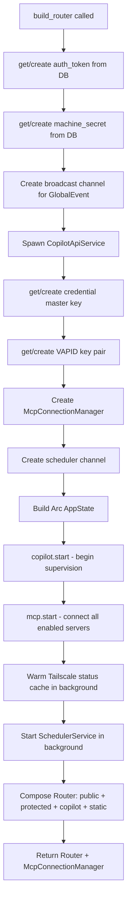

# 03 — AppState and Router

## AppState

`AppState` is the central shared state for all route handlers. It lives behind `Arc<AppState>` — this is **required** (not just good practice) because `DashMap::clone()` performs a deep copy, which would break cancellation.

```rust
pub struct AppState {
    pub pool: SqlitePool,
    pub config: Config,
    pub machine_secret: String,           // encrypts API keys
    pub credential_master_key: String,    // encrypts credential store
    pub auth_token: Arc<RwLock<String>>,  // Bearer token + session cookie value
    pub global_tx: broadcast::Sender<GlobalEvent>,
    pub thread_senders: Arc<Mutex<HashMap<String, Vec<mpsc::Sender<ThreadEvent>>>>>,
    pub run_states: DashMap<String, Arc<RunState>>,
    pub copilot: Option<CopilotApiService>,
    pub mcp: McpConnectionManager,
    pub built_in_tools: Arc<Vec<Arc<dyn AgentTool>>>,
    pub scheduler_tx: mpsc::Sender<SchedulerCommand>,
    pub vapid_public_key: String,
    pub vapid_private_pem: String,
    pub tailscale_status_cache: Arc<TokioRwLock<Option<(TailscaleStatus, Instant)>>>,
    pub server_port: u16,
}
```

### Field-by-field explanation

**`pool: SqlitePool`**  
Single SQLite connection pool (max_connections=1, serialized). Clone is cheap — internally Arc-based.

**`auth_token: Arc<RwLock<String>>`**  
The current auth token. Read by auth middleware on every request. Written by `POST /auth/token/rotate` without server restart.

**`global_tx: broadcast::Sender<GlobalEvent>`**  
Sender for the global SSE channel. All `GET /api/events` clients subscribe via `global_tx.subscribe()`. Events: `ThreadUpdated`, `TitleUpdated`, `McpStatusChanged`, `RoutineFired`, `CopilotAuthStateChanged`.

**`thread_senders`**  
Per-thread SSE senders. Each thread can have multiple connected clients (browser + mobile). `Arc<Mutex<HashMap>>` instead of `DashMap` because the entire map is rarely mutated — lookups dominate.

**`run_states: DashMap<String, Arc<RunState>>`**  
**Critical for cancellation.** Keyed by thread_id. The `POST /messages` handler creates a `RunState`, spawns the agent task, and stores the `RunningTurn` in `run_states[thread_id].running_turn`. The `POST /cancel` handler looks up the same map entry and calls `running_turn.cancel()`. If this were a bare `DashMap` (not wrapped in `Arc<AppState>`), Axum's `State` clone would deep-copy it and cancel would never find the running turn.

**`mcp: McpConnectionManager`**  
Cloneable handle to the MCP connection pool. See `07-mcp-integration.md`.

**`built_in_tools: Arc<Vec<Arc<dyn AgentTool>>>`**  
The 7 built-in tools registered at startup. Immutable after startup. Each `Arc<dyn AgentTool>` is cloned cheaply into the generation loop.

**`tailscale_status_cache`**  
5-minute TTL cache for Tailscale status. Warmed in the background at startup.

---

## RunState

```rust
pub struct RunState {
    pub semaphore: Semaphore,           // capacity-1: serializes agent runs per thread
    pub depth: AtomicUsize,             // number of queued/running tasks
    pub running_turn: Mutex<Option<RunningTurn>>,
}

pub struct RunningTurn {
    pub task: JoinHandle<()>,
    pub cancellation_tx: watch::Sender<bool>,
    pub thread_id: String,
    pub turn_id: Uuid,
}
```

The semaphore serializes runs on a single thread — the second run waits for the first to complete rather than being rejected. The depth counter is used to reject sends that would exceed `MAX_DEPTH = 3`.

To cancel, the handler:
1. Takes `running_turn` from the mutex
2. Calls `running_turn.cancel()` which sends `true` on the watch channel
3. Awaits the JoinHandle so the task has fully cleaned up

---

## Router Construction: `build_router`



---

## Auth Middleware

All protected routes go through `auth_middleware`. It validates one of:
1. `Authorization: Bearer <token>` header
2. `agent_deck_session=<token>` cookie

**Localhost bypass:** Requests from `127.0.0.1` or `::1` skip all auth checks. This allows the server to call its own API (e.g. `POST /api/threads/:id/notify` from the scheduler) without a token.

```rust
if let Some(addr) = connection_info {
    if addr.ip().is_loopback() {
        return Ok(next.run(request).await);
    }
}
```

---

## Route Map

### Public routes (no auth)

| Method | Path | Handler | Description |
|---|---|---|---|
| GET | `/health` | `health::health_check` | Server liveness check |
| GET | `/api/setup/status` | `setup::get_status` | Has setup been completed? |
| POST | `/api/setup/complete` | `setup::complete` | Complete initial setup wizard |
| POST | `/api/auth/token` | `auth::login` | Exchange token for session cookie |
| POST | `/api/auth/logout` | `auth::logout` | Clear session cookie |
| GET | `/api/push/vapid-public-key` | `push::get_vapid_public_key` | VAPID key for Web Push |
| POST | `/api/webhooks` | `webhooks::receive` | Receive inbound webhook payloads |

### Copilot auth routes (genuinely public)

| Method | Path | Description |
|---|---|---|
| GET | `/api/providers/copilot/auth-status` | Is copilot-api authenticated? |
| POST | `/api/providers/copilot/auth-start` | Begin GitHub device flow |
| POST | `/api/providers/copilot/auth-poll` | Poll for device flow completion |
| GET | `/api/providers/copilot/models` | List available Copilot models |

### Protected routes (Bearer token or session cookie required)

#### Providers
| Method | Path | Description |
|---|---|---|
| GET/POST | `/api/providers` | List / create providers |
| GET/PUT/DELETE | `/api/providers/:id` | Get / update / delete provider |
| POST | `/api/providers/:id/test` | Test provider connectivity |

#### Models
| Method | Path | Description |
|---|---|---|
| GET/POST | `/api/providers/:id/models` | List / sync models for provider |
| GET/PUT/DELETE | `/api/providers/:provider_id/models/:model_id` | CRUD on model |

#### Personas
| Method | Path | Description |
|---|---|---|
| GET/POST | `/api/personas` | List / create personas |
| GET/PUT/DELETE | `/api/personas/:id` | Get / update / delete persona |
| POST | `/api/personas/:id/avatar` | Upload avatar image (25MB max) |

#### Credentials
| Method | Path | Description |
|---|---|---|
| GET/POST | `/api/credentials` | List / create credentials |
| GET/PUT/DELETE | `/api/credentials/:id` | Get / update / delete credential |

#### MCP Servers
| Method | Path | Description |
|---|---|---|
| GET/POST | `/api/mcp-servers` | List / create MCP servers |
| GET/PUT/DELETE | `/api/mcp-servers/:id` | Get / update / delete |
| GET | `/api/mcp-servers/:id/tools` | List cached tools |
| POST | `/api/mcp-servers/:id/restart` | Disconnect and reconnect |

#### Threads
| Method | Path | Description |
|---|---|---|
| GET/POST | `/api/threads` | List / create threads |
| GET/PUT/DELETE | `/api/threads/:id` | Get / update / delete thread |
| POST | `/api/threads/:id/generate-title` | Force title regeneration |
| POST | `/api/threads/:id/archive` | Archive thread |
| POST | `/api/threads/:id/unarchive` | Unarchive thread |
| GET/POST | `/api/threads/:id/mcp-servers` | List / attach MCP servers |
| DELETE/PATCH | `/api/threads/:id/mcp-servers/:mcp_id` | Detach / update MCP attachment |

#### Messages
| Method | Path | Description |
|---|---|---|
| GET | `/api/threads/:id/messages` | List messages |
| POST | `/api/threads/:id/messages` | Send message (triggers agent run) |
| POST | `/api/threads/:id/command` | Slash command |
| POST | `/api/threads/:id/cancel` | Cancel running agent turn |
| POST | `/api/threads/:id/notify` | Internal: trigger agent run (used by scheduler) |

#### SSE Streams
| Method | Path | Description |
|---|---|---|
| GET | `/api/threads/:id/stream` | Per-thread SSE stream (tokens, tool activity) |
| GET | `/api/events` | Global SSE stream (thread updates, MCP status, etc.) |

#### Routines
| Method | Path | Description |
|---|---|---|
| GET/POST | `/api/threads/:id/routines` | List / create routines |
| GET/PUT/DELETE | `/api/threads/:thread_id/routines/:routine_id` | CRUD |
| PATCH | `/api/threads/:thread_id/routines/:routine_id/toggle` | Enable/disable |

#### Memory
| Method | Path | Description |
|---|---|---|
| GET/POST | `/api/personas/:id/memory` | List / create memory entries |
| DELETE | `/api/personas/:persona_id/memory/:memory_id` | Delete entry |
| POST | `/api/personas/:id/memory/search` | Full-text search |

#### Push Notifications
| Method | Path | Description |
|---|---|---|
| POST/DELETE | `/api/device-tokens` | Register / unregister FCM device token |
| POST/DELETE | `/api/push/subscribe` | Web Push subscribe / unsubscribe |

#### Miscellaneous
| Method | Path | Description |
|---|---|---|
| GET | `/api/config` | Get app config (setup status, VAPID key, etc.) |
| POST | `/api/auth/token/rotate` | Rotate auth token |
| GET/PUT | `/api/profile` | Get / update user profile |
| GET | `/api/fs/list` | List directory contents |
| GET | `/api/fs/read` | Read file contents |
| GET | `/api/fs/download` | Download file |
| GET | `/api/fs/workspace` | Get thread workspace info |
| GET | `/api/fs/image` | Serve image file |
| GET | `/api/tailscale/status` | Tailscale VPN/Funnel status |
| POST | `/api/tailscale/connect` | Connect to Tailscale |
| POST | `/api/tailscale/serve` | Enable Tailscale Serve |
| POST | `/api/tailscale/funnel/enable` | Enable Tailscale Funnel |
| POST | `/api/tailscale/funnel/disable` | Disable Tailscale Funnel |
| GET/POST | `/api/webhook-bindings` | List / create global webhook bindings |
| DELETE/PATCH | `/api/webhook-bindings/:id` | Delete / update binding |
| PATCH | `/api/webhook-bindings/:id/toggle` | Enable/disable binding |
| GET/POST | `/api/threads/:id/webhook-bindings` | List / attach bindings to thread |
| DELETE/PATCH | `/api/threads/:id/webhook-bindings/:attachment_id` | Detach / update attachment |
| POST | `/api/threads/:id/upload` | Upload file attachment (25MB max) |
