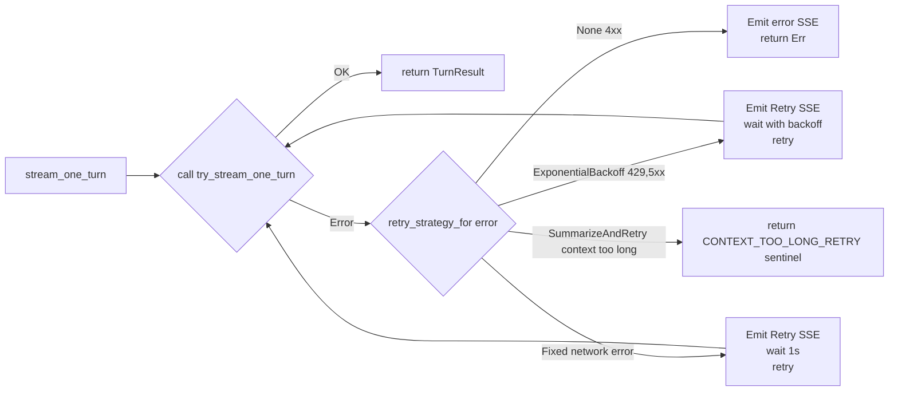
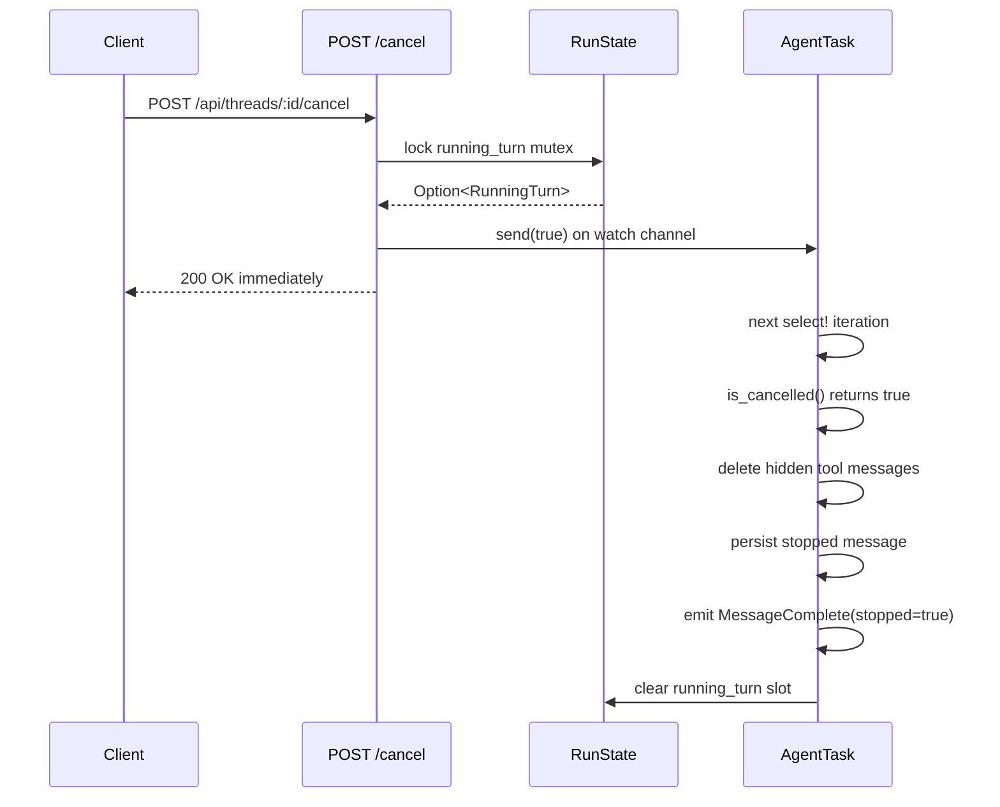

# 04 — Agent Run-Loop

The agent run-loop is the heart of Vestry. It lives in `server/src/services/agent.rs` (~1400 lines). Understanding it fully is the key to understanding the whole system.

---

## Entry point: `agent::run`

```rust
pub async fn run(
    state: Arc<AppState>,
    thread_id: String,
    user_message: String,
    cancellation_rx: watch::Receiver<bool>,
    run_state: Arc<RunState>,
    turn_id: Uuid,
    is_routine: bool,
)
```

Called from `POST /api/threads/:id/messages` and `POST /api/threads/:id/notify`. Always spawned inside `tokio::spawn`. Errors are caught internally and emitted as SSE `error` events — the caller never needs to handle the return value.

---

## Complete execution flow

```mermaid
flowchart TD
    START([POST /messages or /notify]) --> SPAWN[tokio::spawn agent::run]

    SPAWN --> FETCH[Fetch thread + persona from DB]
    FETCH --> PROFILE[Load user profile if non-default persona]
    PROFILE --> ROUTINE{is_routine?}
    ROUTINE -- yes --> PARSE_ROUTINE[Parse routine_id from JSON message\nCreate routine_executions row status=running]
    ROUTINE -- no --> RESOLVE_PROVIDER
    PARSE_ROUTINE --> RESOLVE_PROVIDER

    RESOLVE_PROVIDER[Resolve provider + model\nThread overrides > persona defaults] --> BUILD_PROVIDER[build_provider\nOpenAiProvider or CopilotProvider]
    BUILD_PROVIDER --> LOAD_HISTORY[Load last N visible messages\nOFFSET = summary_message_count]
    LOAD_HISTORY --> LOAD_MCP[Load attached MCP servers\nfor this thread]
    LOAD_MCP --> BUILD_TOOLS[Build namespaced MCP tool list\ntag__tool_name for each tool]
    BUILD_TOOLS --> WORKSPACE[Create thread workspace dir\nif non-routine]
    WORKSPACE --> ASSEMBLE[context::assemble\nBuild full message array + tool list]

    ASSEMBLE --> GEN_LOOP[generation_loop]

    GEN_LOOP --> STREAM[stream_one_turn\nwith retry on transient errors]
    STREAM --> TOKENS[Emit Token SSE events to connected clients]
    TOKENS --> CANCELLED{Cancelled?}
    CANCELLED -- yes --> STOPPED[Persist stopped message\nEmit MessageComplete stopped=true]
    CANCELLED -- no --> TOOL_CALLS{Tool calls\nrequested?}
    TOOL_CALLS -- no --> PERSIST_NORMAL[Persist normal assistant message\nEmit MessageComplete]
    TOOL_CALLS -- yes --> EXEC_TOOLS[execute_tool_calls\nparallel dispatch]

    EXEC_TOOLS --> BUILTIN{Built-in\ntool?}
    BUILTIN -- yes --> RUN_BUILTIN[tool.run\nMemory / recall / etc.]
    BUILTIN -- no --> MCP_ROUTE[execute_mcp_tool\nRoute by tag prefix]
    RUN_BUILTIN --> PERSIST_HIDDEN[Persist hidden tool messages]
    MCP_ROUTE --> PERSIST_HIDDEN
    PERSIST_HIDDEN --> TOOL_RESULT_SSE[Emit ToolActivity SSE events]
    TOOL_RESULT_SSE --> EMIT_ROUND[Emit ToolRoundComplete SSE]
    EMIT_ROUND --> NEXT_TURN[Add tool results to message array\nLoop back to stream_one_turn]

    NEXT_TURN --> STREAM

    PERSIST_NORMAL --> FIRST_MSG{First user\nmessage?}
    FIRST_MSG -- yes --> TITLE[title_service::try_llm_title\nPersist title\nEmit TitleUpdated global SSE]
    FIRST_MSG -- no --> ROUTINE_COMPLETE
    TITLE --> ROUTINE_COMPLETE

    ROUTINE_COMPLETE{is_routine?}
    ROUTINE_COMPLETE -- yes --> UPDATE_EXEC[Update routine_executions\nstatus=completed\nEmit RoutineFired global SSE]
    ROUTINE_COMPLETE -- no --> PUSH
    UPDATE_EXEC --> PUSH

    PUSH[Send push notification\nif no SSE client watching] --> THREAD_UPDATED[Emit ThreadUpdated global SSE]
    THREAD_UPDATED --> SUMMARIZE{auto_summarize\nand enough new msgs?}
    SUMMARIZE -- yes --> BACKGROUND_SUMMARY[summarization::summarize_thread]
    SUMMARIZE -- no --> DONE([Done])
    BACKGROUND_SUMMARY --> DONE
```



---

## generation_loop

Thin coordinator — loops over turns, calling `stream_one_turn` then `execute_tool_calls`. Max 50 tool rounds before giving up (prevents infinite loops).

```rust
const MAX_TOOL_ROUNDS: usize = 50;
```

On cancellation: deletes all hidden tool messages created during the run by exact ID (precise cleanup), then persists a stopped message.

On normal completion: persists the final assistant message and emits `MessageComplete`.

Multi-turn text segments (text emitted before a tool call in the same turn) are persisted as `chat_segment` messages and emitted as `ChatSegment` SSE events.

---

## stream_one_turn + retry logic



**Retry strategies:**
| HTTP status | Strategy |
|---|---|
| 429 | ExponentialBackoff: initial=2s, max=4 attempts |
| 500/502/503/504 | ExponentialBackoff: initial=1s, max=3 attempts |
| Network error (connection/timeout) | Fixed: 1s, max=2 attempts |
| Context too long (413, context_length_exceeded, etc.) | SummarizeAndRetry |
| 4xx (other) | None — surface immediately |

The `SummarizeAndRetry` sentinel bubbles up to `run_inner`, which triggers reactive summarization, reloads history from the new boundary, and retries the generation loop once.

---

## try_stream_one_turn

Drives the raw SSE token stream from the provider:

```rust
loop {
    tokio::select! {
        biased;
        chunk = token_stream.next() => {
            // Classify chunk into StreamEvent::TextDelta or StreamEvent::ToolCallFragment
            handle_stream_event(event, state, thread_id, &mut turn_text, &mut pending_calls).await;
        }
        _ = cancellation_watcher.changed() => {
            // Cooperative cancellation — return TurnResult { cancelled: true }
        }
    }
}
```

Tool call fragments arrive across multiple chunks and are accumulated in `Vec<PendingToolCall>`. Slots without a name or id at stream end are filtered out (some providers emit index fragments before name/id).

---

## execute_tool_calls

All `ToolStart` events are emitted **upfront** (before any tool executes) so the frontend sees the complete round at once. Then all tools in the round run in **parallel** via `futures::future::join_all`.

```rust
// Emit all ToolStart events first
for tc in calls {
    state.send_thread_event(thread_id, ThreadEvent::ToolStart { ... });
}

// Then run all in parallel
let futures_vec = calls.iter().map(|tc| async move {
    if is_cancelled(cancellation_rx) {
        return ("Tool call cancelled by user.".to_string(), vec![]);
    }
    if let Some(tool) = maybe_built_in {
        // Built-in tool path
    } else {
        // MCP tool path
    }
}).collect();

let all_results = futures::future::join_all(futures_vec).await;
```

Input preview computation (`compute_input_preview`) extracts a brief summary of args for the `ToolStart` event — e.g. just the `path` for file tools, first 80 chars of `command` for bash tools.

---

## execute_mcp_tool

Routes by tag prefix: `github__create_issue` → tag=`github`, tool=`create_issue`.

Before forwarding to MCP server, injects credentials:
```rust
let args = credentials::inject_credentials(args, &state.pool, &state.credential_master_key).await?;
```

Respects per-server and per-thread timeout overrides:
```rust
if let Some(secs) = timeout_secs {
    tokio::time::timeout(Duration::from_secs(secs as u64), state.mcp.call_tool(...)).await
        .unwrap_or_else(|_| Err(anyhow!("Tool call timed out after {}s", secs)))
} else {
    state.mcp.call_tool(&s.id, tool_name, args).await
}
```

Also selects on `cancellation_rx` so in-flight MCP calls can be interrupted immediately.

---

## Title generation

After the first assistant reply (`user_message_count == 1`), title generation runs:

```rust
let generated_title = title_service::try_llm_title(state, &thread, &user_content, assistant_content).await;
sqlx::query("UPDATE threads SET title = ? WHERE id = ?").bind(&generated_title).bind(thread_id).execute(&pool).await?;
state.send_global_event(GlobalEvent::TitleUpdated { thread_id, title: generated_title });
```

The `TitleUpdated` global SSE event causes the sidebar to update in real time without a page reload.

---

## Proactive summarization

After each turn completes:
```rust
if (new_total - thread.summary_message_count) >= DEFAULT_HISTORY_LIMIT as i64 {
    let _ = summarization::summarize_thread(state, thread_id).await;
}
```

`DEFAULT_HISTORY_LIMIT = 20`. When 20 new visible messages have accumulated since the last summary, a background summarization run is triggered.

---

## Provider factory: `build_provider`

```rust
pub fn build_provider(state: &AppState, row: &Provider) -> Result<Box<dyn LlmProvider>> {
    match row.kind.as_str() {
        "copilot" => {
            // Wraps CopilotApiService availability check
            Ok(Box::new(CopilotProvider::new(...)))
        }
        "openai" | "custom" | "anthropic" => {
            // Decrypt API key if stored
            let api_key = encryption::decrypt(&row.api_key, &state.machine_secret)?;
            Ok(Box::new(OpenAiProvider::new(&row.name, &row.base_url, api_key)))
        }
        unknown => Err(anyhow!("Unknown provider kind '{}'", unknown))
    }
}
```

---

## User profile context injection

When the thread's persona is not the Default persona, the user's profile is injected as a system message:

```rust
// Injected at position 1.5 (between persona prompt and thread addendum)
"## About the User

Name: Alice
Pronouns: she/her
Role: Senior Engineer
Organization: Acme Corp
Location: San Francisco
Timezone: America/Los_Angeles
About: I prefer terse answers."
```

Only injected when more than just `display_name` is filled in (must have at least one additional field).

---

## Cancellation architecture



The `cancellation_rx` watch channel is checked at multiple points:
1. Top of the `'turn_loop` in `generation_loop`
2. Inside `try_stream_one_turn` via `tokio::select!`
3. Between tool calls in `execute_tool_calls`
4. Inside `execute_mcp_tool` via `tokio::select!`
5. During retry backoff sleep

This means cancellation is responsive within milliseconds regardless of what the agent is doing.
