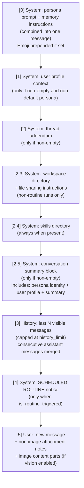

# 05 — Context Assembly

Context assembly lives in `server/src/services/context.rs`. It is **intentionally pure** — zero database or network calls. The caller loads all required data and passes it in via `AssemblyInput`.

---

## AssemblyInput

```rust
pub struct AssemblyInput {
    pub persona_emoji: Option<String>,
    pub persona_system_prompt: String,
    pub thread_addendum: Option<String>,
    pub user_profile_context: Option<String>,   // "## About the User\n\nName: Alice..."
    pub history: Vec<HistoryMessage>,
    pub history_limit: Option<usize>,            // defaults to DEFAULT_HISTORY_LIMIT = 20
    pub user_message: String,
    pub is_routine_triggered: bool,
    pub supports_tools: bool,
    pub include_memory: bool,                    // false for Default persona
    pub built_in_tool_defs: Vec<ChatCompletionTool>,
    pub mcp_tools: Vec<ChatCompletionTool>,
    pub conversation_summary: Option<String>,
    pub workspace_path: Option<String>,
    pub skills_dir: Option<String>,
    pub attachments: Vec<MessageAttachment>,
    pub provider_supports_vision: bool,
}
```

---

## Assembly order



---

## Message 0: Persona + Memory

The persona prompt and memory instructions are **combined into a single system message** so the persona's voice is not interrupted.

```
{emoji}

{persona_system_prompt}

## Memory

You have persistent long-term memory...
[full MEMORY_INSTRUCTIONS constant]

## Conversation Recall

You also have access to a `recall_conversation` tool...
```

When `include_memory = false` (Default persona), the memory instructions are omitted entirely. The built-in tools are also removed from the tool list.

---

## Message 1.5: User Profile

Injected only when:
- `user_profile_context` is `Some` and non-empty after trimming
- Content is built by `format_user_profile_context` in `agent.rs`

Format:
```
## About the User

Name: Alice
Pronouns: she/her
Role: Senior Engineer
...
```

---

## Message 2: Thread Addendum

Optional per-thread system prompt. Whitespace-only values are treated as absent.

---

## Message 2.3: Workspace Directory

Injected for non-routine runs when `workspace_path` is set. Teaches the agent:
- Where its per-thread workspace directory is
- How to share files using `/api/fs/read?path=<encoded-path>` links
- The distinction between read (preview) and download links

---

## Message 2.4: Skills Directory

Injected when `skills_dir` is set. Points the agent at the skills/ directory and explains how to list and read skill guides on demand.

---

## Message 2.5: Conversation Summary Block

The richest injected block. When present, includes:
1. Persona identity re-injection (ensures model knows who it is after context window rollover)
2. User profile context (if available)
3. The rolling summary text

Structure:
```
## Conversation Context

### Your Persona

{persona_system_prompt}

{user_profile_context}

### Conversation Summary

The following is a summary of the conversation history up to this point...

{summary_text}
```

---

## History loading

History is loaded with `LIMIT 20 OFFSET summary_message_count`. The offset ensures that messages already captured in the summary are not repeated.

Consecutive assistant messages are **merged** with `\n\n` between them. This handles the case where multi-segment responses (text + tool calls + more text) produce multiple assistant rows.

```rust
if msg.role == "assistant" {
    match pending_assistant {
        Some(ref mut acc) => { acc.push_str("\n\n"); acc.push_str(&msg.content); }
        None => pending_assistant = Some(msg.content.clone()),
    }
    continue;
}
// Non-assistant role: flush buffered assistant content first
if let Some(content) = pending_assistant.take() {
    messages.push(assistant_message(content));
}
```

---

## Routine notice (Message 4)

```
SYSTEM NOTICE — SCHEDULED ROUTINE

The following message was NOT sent by the user...

Behavioral guidelines for routine responses:
- Respond as if writing a report or briefing, not a conversation.
- Do NOT greet the user...
- Be direct and concise...
```

---

## Image attachment handling

When `provider_supports_vision = true` and image attachments are present:

1. Each image is read from disk
2. Compressed to JPEG at 82% quality, max 2048px on each side (via `compress_image_for_llm`)
3. Base64-encoded as a `data:image/jpeg;base64,...` URI
4. Embedded as `image_url` content parts alongside the text

When vision is **not** supported, images are mentioned as text notes:
```
[Attached image: photo.png — available at /path/to/workspace/photo.png]
```

Non-image attachments are always text notes regardless of vision support.

---

## Tool list construction

```rust
fn build_tool_definitions(
    built_in_tool_defs: Vec<ChatCompletionTool>,
    mcp_tools: Vec<ChatCompletionTool>,
) -> Vec<ChatCompletionTool> {
    let mut tools = built_in_tool_defs;
    tools.extend(mcp_tools);
    tools
}
```

Built-ins come first. MCP tools follow. MCP tools are already namespaced (`tag__tool_name`) by the time they reach context assembly.

When `include_memory = false` (Default persona), built-in tools are excluded even if passed in. MCP tools are **always** included regardless of persona type.

When `supports_tools = false`, the entire tool list is empty.

---

## Constants

```rust
pub const DEFAULT_HISTORY_LIMIT: usize = 20;
```

The memory instructions (`MEMORY_INSTRUCTIONS`) and skills block template (`SKILLS_BLOCK_TEMPLATE`) are constants in `context.rs` — they are embedded in the binary and never read from disk at runtime.
