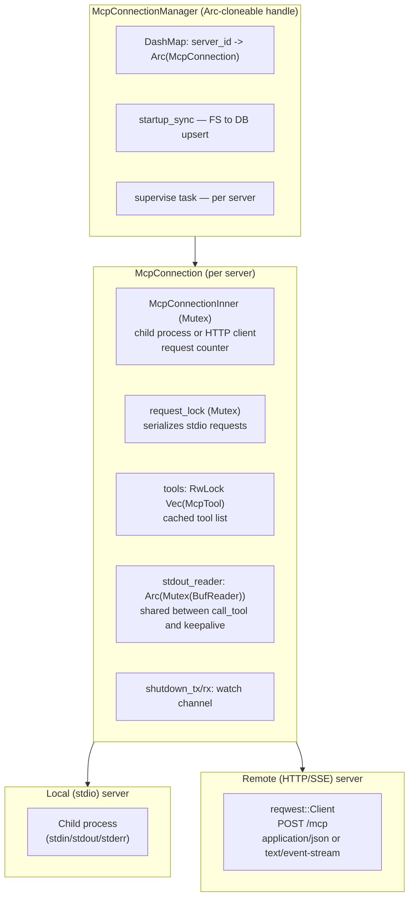
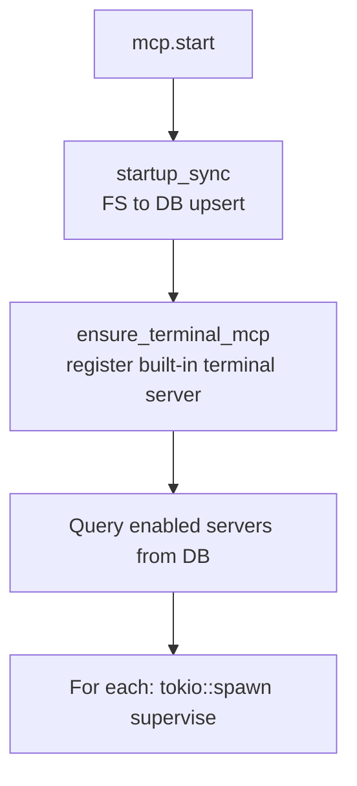
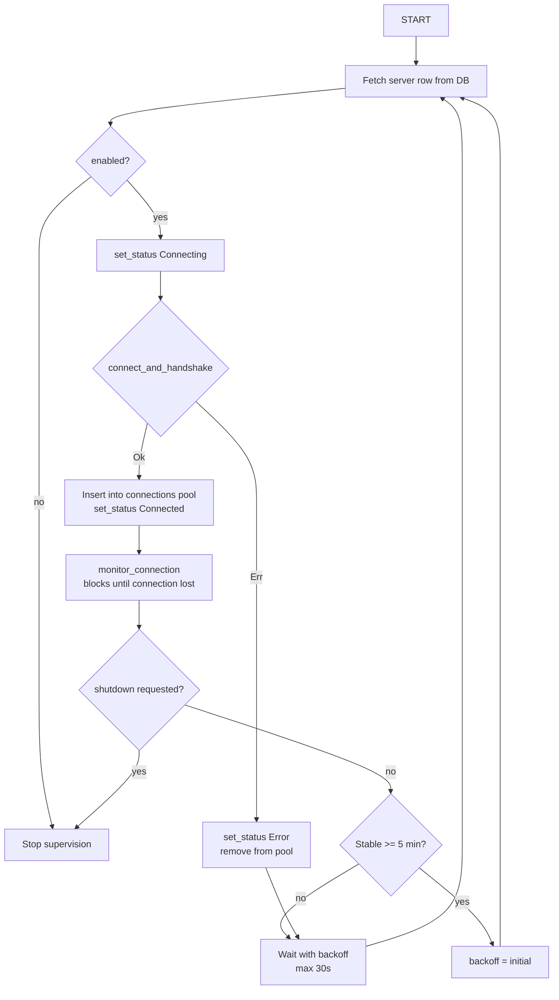
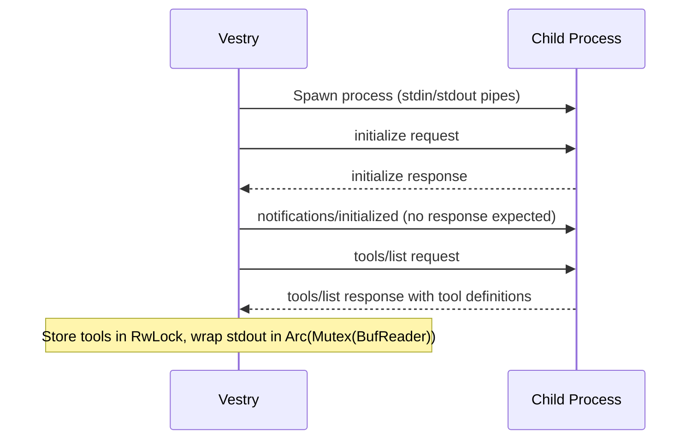
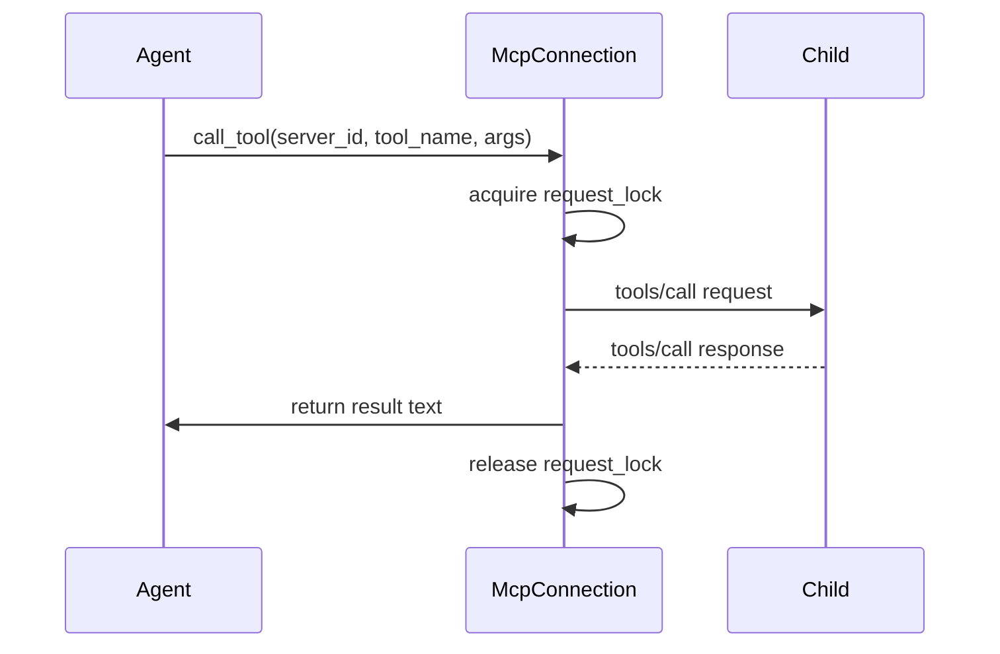

# 07 — MCP Integration

MCP (Model Context Protocol) management lives in `server/src/services/mcp.rs` (~1100 lines). It is the most complex single file in the codebase.

---

## Architecture overview



---

## McpConnectionManager

Cloneable handle — all heavy state lives behind an inner `Arc`. Safe to clone into any async task.

```rust
pub struct McpConnectionManager {
    connections: Arc<DashMap<String, Arc<McpConnection>>>,
    pool: SqlitePool,
    master_key: String,
    global_tx: broadcast::Sender<GlobalEvent>,
    mcp_dir: PathBuf,
}
```

### Startup flow



### startup_sync

Scans `mcp_dir/` for subdirectories containing `config.json`:
- If DB row exists for the ID in config.json: **update** name/tag/server_type/config from filesystem
- If no DB row: **insert** new row with `enabled=1, status=inactive`
- For enabled DB rows whose `config.json` is **gone**: **disable** the row

This makes the filesystem the source of truth for MCP server configuration. Operators can install a server by dropping a `config.json` in a subdirectory and restarting.

**UUID migration:** If a directory is named with a UUID (old format), it's renamed to its tag-based name automatically.

---

## Supervision loop

Each server runs in a dedicated `tokio::spawn` supervision task:



**Backoff constants:**
```rust
const BACKOFF_INITIAL: Duration = Duration::from_secs(1);
const BACKOFF_MAX: Duration = Duration::from_secs(30);
const STABILITY_THRESHOLD: Duration = Duration::from_secs(300); // 5 min
```

---

## Local (stdio) transport

### Handshake sequence



### Tool call sequence



The `request_lock` is crucial — it serializes all requests on a single stdio channel. Without it, interleaved writes would produce garbled JSON.

### Keepalive

A separate `run_keepalive_local` task sends a `tools/list` ping every 45 seconds to prevent the child process from idle-exiting. It uses `try_lock` on `request_lock` — if a real request is in flight, the keepalive skips that tick rather than blocking.

### Process monitoring

`monitor_local` polls `child.try_wait()` every 2 seconds (non-blocking). When the child exits, supervision resumes and reconnect-with-backoff begins.

---

## Remote (HTTP/SSE) transport

### Config

```rust
struct RemoteConfig {
    url: String,
    credential_key: Option<String>,    // Looked up in credential store
    auth_header: Option<String>,       // Default: "Authorization"
    auth_format: Option<String>,       // Default: "Bearer {value}"
    headers: HashMap<String, String>,  // Static extra headers
}
```

### Handshake

Same `initialize` / `notifications/initialized` / `tools/list` sequence as local, but via HTTP POST.

**Streamable HTTP spec support:** The server must accept both `application/json` and `text/event-stream` responses. When the server responds with `text/event-stream`, the first `data:` line is parsed as the JSON-RPC response.

```rust
let content_type = response.headers().get("content-type")...;
if content_type.contains("text/event-stream") {
    // Read SSE stream, find first data: line, parse as JSON-RPC
} else {
    // Parse as direct JSON
}
```

### Remote monitoring

Pings via `tools/list` every 30 seconds. On failure, returns from `monitor_remote` which triggers reconnect.

---

## Credential injection in env vars

For local servers, env var values support a placeholder syntax:

- `GITHUB_TOKEN: CRED_PLACEHOLDER(my_github)` resolves `secret` field of credential `my_github`
- `API_KEY: CRED_PLACEHOLDER(schwab:api_key)` resolves `api_key` field of credential `schwab`
- `SECRET: CRED_PLACEHOLDER(schwab:secret)` resolves `secret` field of credential `schwab`
- Plain values (no placeholder) → passed through unchanged

The actual runtime syntax uses curly-brace prefix. See `services/credentials.rs` for the resolve functions:
- `resolve_secret(pool, master_key, key)` — returns the credential's secret field
- `resolve_field(pool, master_key, key, field)` — returns any named field (api_key, password, etc.)

Resolution happens at **connect time** (when the child process is spawned). Secrets are passed as real env var values to the process and are never stored in the DB or log files.

---

## Tool namespacing

MCP tools are namespaced as `{tag}__{tool_name}`. The tag is validated:
- Non-empty, max 64 characters
- Only ASCII alphanumeric, hyphens, underscores

```rust
pub fn validate_tag(tag: &str) -> Result<(), String> {
    if tag.is_empty() { return Err("tag must not be empty".to_string()); }
    if tag.len() > 64 { return Err("tag must be 64 characters or fewer".to_string()); }
    if !tag.chars().all(|c| c.is_ascii_alphanumeric() || c == '-' || c == '_') {
        return Err("tag may only contain letters, digits, hyphens, and underscores".to_string());
    }
    Ok(())
}
```

When the agent calls `github__create_issue`, it is split on the first `__` to get `tag=github` and `tool=create_issue`. The manager looks up the connection by tag.

---

## Tool list caching

Tool lists are cached in `conn.tools: RwLock<Vec<McpTool>>`. Written once after `tools/list` during handshake. Refreshed on every reconnect. Read by `cached_tools()` which is called during context assembly (agent.rs step 4.5).

---

## Status broadcasting

Status changes are persisted to the DB (`mcp_servers.status`) and broadcast via the global SSE channel:

```rust
fn broadcast_status(&self, server_id: &str, status: McpStatus) {
    let event = GlobalEvent::McpStatusChanged {
        mcp_server_id: server_id.to_string(),
        status: status.as_str().to_string(),
        reason: status.reason(),
    };
    let _ = self.global_tx.send(event);
}
```

The frontend subscribes to the global stream and updates the MCP server status indicator in real time.

---

## Filesystem config management

When a server is created or updated via the API:
- `write_config_file` writes `mcp_dir/{tag}/config.json`
- `delete_config_dir` removes `mcp_dir/{tag}/` on delete

This keeps the filesystem in sync with the DB so `startup_sync` works correctly on restart.

**config.json format on disk:**
```json
{
  "id": "uuid-here",
  "name": "github",
  "tag": "github",
  "server_type": "local",
  "config": {
    "executable": "docker",
    "args": ["run", "--rm", "-i", "mcp/github"],
    "env": {}
  }
}
```
