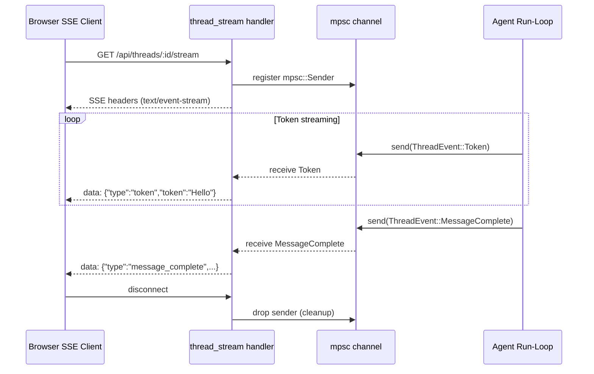

# 08 — SSE and Real-time Events

---

## Two SSE channels

Vestry has two distinct SSE streams:

| Channel | Endpoint | Purpose | Scope |
|---|---|---|---|
| Per-thread stream | `GET /api/threads/:id/stream` | Token streaming, tool activity, message complete | Single thread |
| Global stream | `GET /api/events` | Thread updates, title changes, MCP status, routine fired | All threads |

---

## Per-thread stream: `ThreadEvent`

```rust
pub enum ThreadEvent {
    Token { token: String },
    ChatSegment { id, thread_id, content, created_at },
    MessageComplete { id, thread_id, role, content, created_at, stopped },
    ToolStart { tool_name, tool_call_id, round, input_preview },
    ToolRoundComplete { round, tool_count },
    ToolActivity { id, role, content, created_at, tool_call_id, round },
    RoutineMessage { id, thread_id, role, content, routine_id, created_at },
    Error { code, message },
    Retry { attempt, max_attempts, reason },
}
```

`ThreadEvent` messages are sent via `state.send_thread_event(thread_id, event)` which broadcasts to all connected SSE clients for that thread.

Thread senders are stored in `AppState.thread_senders`:
```rust
Arc<Mutex<HashMap<String, Vec<mpsc::Sender<ThreadEvent>>>>>
```

Each connected client (`GET /api/threads/:id/stream`) registers a new `mpsc::Sender` in this map. When the client disconnects, the sender is dropped and the next send attempt silently fails.

### Token streaming flow



---

## Global stream: `GlobalEvent`

```rust
pub enum GlobalEvent {
    ThreadUpdated { thread_id, last_message, updated_at },
    TitleUpdated { thread_id, title },
    McpStatusChanged { mcp_server_id, status, reason },
    RoutineFired { thread_id, routine_id, routine_name },
    CopilotAuthStateChanged { authenticated, username },
}
```

Uses a `tokio::sync::broadcast::Sender<GlobalEvent>` with capacity 256. All `GET /api/events` clients subscribe via `global_tx.subscribe()`.

`send_global_event` is a helper on `AppState`:
```rust
pub fn send_global_event(&self, event: GlobalEvent) -> Result<usize, SendError<GlobalEvent>> {
    self.global_tx.send(event)
}
```

Send errors (no receivers) are silently ignored — normal when no client is connected.

---

## Event serialization

Both `ThreadEvent` and `GlobalEvent` serialize to JSON with a `type` discriminant field. Examples:

```json
{"type":"token","token":"Hello"}
{"type":"message_complete","id":"msg-uuid","thread_id":"thread-uuid","role":"assistant","content":"...","created_at":"2025-01-01T...","stopped":false}
{"type":"tool_start","tool_name":"github__create_issue","tool_call_id":"call_abc","round":1,"input_preview":{"tool":"create_issue","server":"github"}}
{"type":"tool_round_complete","round":1,"tool_count":2}
{"type":"thread_updated","thread_id":"...","last_message":"...","updated_at":"..."}
{"type":"mcp_status_changed","mcp_server_id":"...","status":"connected","reason":null}
```

---

## Frontend SSE consumption

The frontend stores events in Zustand:

- `useSseStore.ts` — manages the SSE connection lifecycle
- `useMessageStore.ts` — processes `Token` events into streaming message state
- `tokenBuffer.ts` — smooth token buffering for display (prevents jarring frame-by-frame updates)

`Token` events are buffered and flushed to `useMessageStore` at a controlled rate. `MessageComplete` replaces the buffered streaming content with the final persisted message.

---

## Push notifications

When no SSE client is watching a thread, completed agent replies trigger push notifications:

**Web Push (VAPID):**
- Subscription stored in `push_subscriptions` table
- `services/push.rs` sends via `web_push` crate using VAPID keys
- Subject: `{persona_emoji} {persona_name}`
- Body: first 120 chars of response (markdown stripped)

**FCM (Firebase Cloud Messaging):**
- Used for React Native mobile app
- Token stored in `device_tokens` table
- Triggered via `FCM_SERVICE_ACCOUNT_JSON` service account

The `strip_markdown_for_notification` function in `agent.rs` removes `[label](url)` links, collapsing them to just the label text, and normalizes newlines to spaces for a clean single-line preview.
