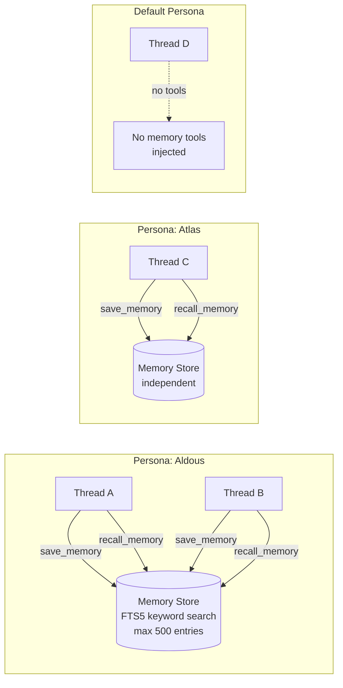

# 10 — Memory System

---

## Overview

Each non-default persona has its own isolated memory store. The Default persona (`is_default = 1`) has no memory tools injected at all.



---

## Database schema

```sql
CREATE TABLE memories (
    id         TEXT PRIMARY KEY,   -- UUID
    persona_id TEXT NOT NULL REFERENCES agent_personas(id) ON DELETE CASCADE,
    user_id    TEXT NOT NULL REFERENCES users(id),
    content    TEXT NOT NULL,
    created_at TEXT NOT NULL
);

CREATE VIRTUAL TABLE memories_fts USING fts5(
    content,
    content='memories',
    content_rowid='rowid'
);
```

FTS5 is configured with `content='memories'` (content table) so the actual text lives in `memories` and FTS5 maintains an index. Deletions require a manual FTS5 sync.

---

## Built-in tools

All 7 built-in tools are defined in `server/src/services/tools.rs`:

### `save_memory`
```json
{
  "name": "save_memory",
  "description": "Save a piece of information to long-term memory...",
  "parameters": {
    "type": "object",
    "required": ["content"],
    "properties": {
      "content": { "type": "string", "description": "The text to store in memory. Maximum 500 characters." }
    }
  }
}
```

Implementation:
1. Checks current count — returns error if >= 500
2. Inserts into `memories` table
3. Updates FTS5 index
4. Returns confirmation with the new memory ID

### `recall_memory`
```json
{
  "name": "recall_memory",
  "parameters": {
    "required": ["query"],
    "properties": {
      "query": { "type": "string", "description": "1-3 keywords to search for..." }
    }
  }
}
```

Implementation:
1. Runs FTS5 prefix search:
   ```sql
   SELECT m.id, m.content, m.created_at
   FROM memories m
   JOIN memories_fts ON memories_fts.rowid = m.rowid
   WHERE memories_fts MATCH ? AND m.persona_id = ?
   ORDER BY rank
   LIMIT 10
   ```
2. Returns results formatted as:
   ```
   id: uuid-here
   created: 2025-01-01T00:00:00Z
   content here

   id: uuid-2
   ...
   ```
3. Returns "No memories found matching..." if empty

**Prefix search:** Multiple keywords are OR-matched with prefix search, so `typescript dog` returns entries containing words starting with `typescript` OR `dog`.

### `delete_memory`
```json
{
  "name": "delete_memory",
  "parameters": {
    "required": ["memory_id"],
    "properties": {
      "memory_id": { "type": "string" }
    }
  }
}
```
Deletes by ID, updates FTS5 index, returns confirmation.

### `recall_conversation`
```json
{
  "name": "recall_conversation",
  "parameters": {
    "properties": {
      "from_date": { "type": "string", "description": "ISO 8601 start date" },
      "to_date": { "type": "string", "description": "ISO 8601 end date" },
      "keywords": { "type": "string", "description": "Optional keyword filter" }
    }
  }
}
```

Queries thread summaries within the date range. Returns narrative summaries of past conversations. Complementary to `recall_memory` — facts live in memory, context lives in conversation summaries.

### `tailscale_status`
Returns the current Tailscale VPN and Funnel status. Used by agents that need to understand the network connectivity context (e.g. for webhook configuration advice).

### `set_mcp_timeout`
```json
{
  "name": "set_mcp_timeout",
  "parameters": {
    "required": ["server_tag", "timeout_secs"],
    "properties": {
      "server_tag": { "type": "string" },
      "timeout_secs": { "oneOf": [{"type":"integer","minimum":1}, {"type":"null"}] }
    }
  }
}
```
Updates the per-thread tool call timeout for an MCP server. `null` removes the override.

### `describe_image`
```json
{
  "name": "describe_image",
  "parameters": {
    "required": ["path"],
    "properties": {
      "path": { "type": "string", "description": "Absolute path to image file" },
      "prompt": { "type": "string", "description": "Optional question about the image" }
    }
  }
}
```
Reads the image from disk, encodes as base64, and makes a separate vision completion request. Returns the vision analysis as the tool result. This allows non-vision-capable models to still analyze images by delegating to a vision model.

---

## Memory instructions injection

When `include_memory = true`, the following is appended to the persona's system prompt (in `context.rs`):

```
## Memory

You have persistent long-term memory that spans across all our conversations. Use it actively:

**When to save:** When I share a preference, a fact about myself, a deadline...

**When to recall:** Before answering questions that might benefit from prior context...

**When to delete:** Before saving something you may already know, call recall_memory first...

**Do not** tell me every time you save, recall, or delete a memory.

## Conversation Recall

You also have access to a `recall_conversation` tool...
```

The instructions guide the model on when to proactively use each tool without being prompted.

---

## Max entries enforcement

The 500-entry limit is enforced at the service layer in `save_memory`:
```rust
let count: i64 = sqlx::query_scalar(
    "SELECT COUNT(*) FROM memories WHERE persona_id = ?"
).bind(persona_id).fetch_one(pool).await?;

if count >= 500 {
    return Ok("Memory store is full (500 entries). Use recall_memory to review your memories \
               for consolidating and deleting entries that are no longer relevant...".to_string());
}
```

The error message is returned as a successful tool result (not an error) so the model sees it and can act on it (delete old entries, consolidate, etc.).
