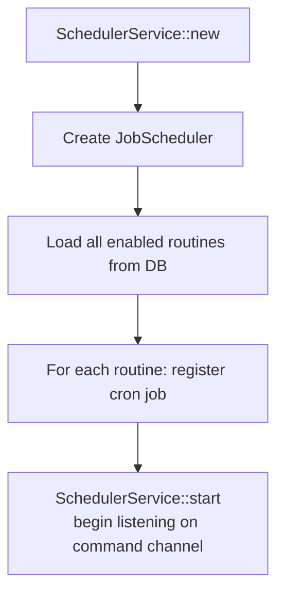
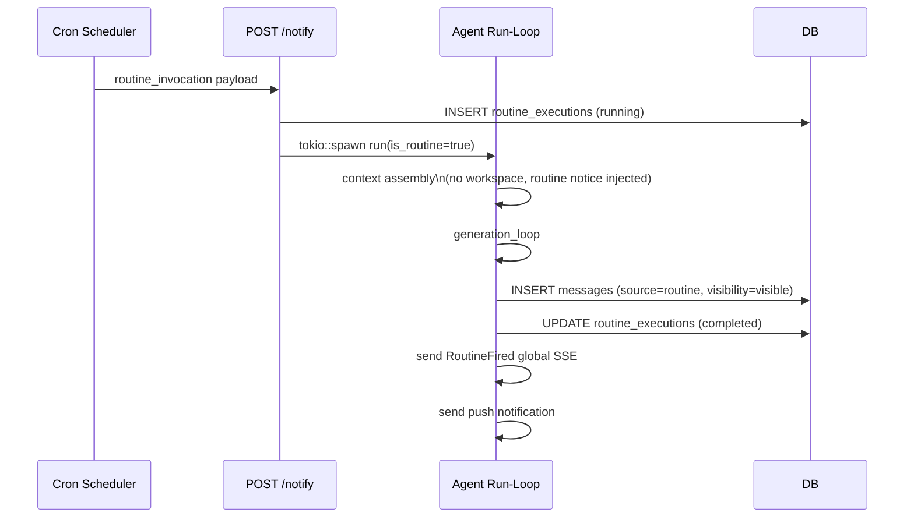

# 12 — Scheduler and Routines

---

## Overview

The scheduler enables time-triggered agent runs. Each `Routine` has a cron expression, and when it fires, the scheduler posts to `POST /api/threads/:id/notify` which triggers a full agent run (same path as manual messages, but `is_routine = true`).

---

## Data model

```sql
CREATE TABLE routines (
    id           TEXT PRIMARY KEY,
    thread_id    TEXT NOT NULL REFERENCES threads(id) ON DELETE CASCADE,
    name         TEXT NOT NULL,
    instructions TEXT NOT NULL,   -- Injected as the "user message" for the run
    cron_expr    TEXT NOT NULL,   -- Standard 5-field cron: "0 9 * * 1-5"
    enabled      BOOLEAN NOT NULL DEFAULT 1,
    created_at   TEXT NOT NULL,
    updated_at   TEXT NOT NULL
);

CREATE TABLE routine_executions (
    id                TEXT PRIMARY KEY,
    routine_id        TEXT NOT NULL REFERENCES routines(id) ON DELETE CASCADE,
    thread_id         TEXT NOT NULL REFERENCES threads(id) ON DELETE CASCADE,
    fired_at          TEXT NOT NULL,
    completed_at      TEXT,
    status            TEXT NOT NULL DEFAULT 'running',  -- running | completed | failed
    output_message_id TEXT,   -- FK to the final assistant message
    error             TEXT
);
```

---

## SchedulerService

Lives in `services/scheduler.rs`. Holds a `tokio_cron_scheduler::JobScheduler`.

### Startup



### Command channel

```rust
pub enum SchedulerCommand {
    Register(Routine),    // Add or update a cron job
    Remove(String),       // Remove by routine_id
}
```

Route handlers (create, update, toggle, delete) send commands through `state.scheduler_tx`. The scheduler receives on the other end and updates the live job registry.

### Job execution

When a cron job fires:

```rust
// Construct the routine trigger message
let trigger_payload = serde_json::json!({
    "type": "routine_invocation",
    "routine_id": routine_id,
    "routine_name": routine_name,
    "instructions": instructions,
    "fired_at": fired_at,
});

// POST to the notify endpoint (localhost bypass — no auth needed)
reqwest::Client::new()
    .post(format!("http://localhost:{}/api/threads/{}/notify", port, thread_id))
    .json(&trigger_payload)
    .send()
    .await
```

The `POST /api/threads/:id/notify` handler is identical to the message send handler except `is_routine = true` is passed to `agent::run`.

---

## Agent run differences for routines

When `is_routine = true`:

1. **No workspace path** — `workspace_path = None` (no file-sharing instructions injected)
2. **Routine trigger message** — the JSON payload is parsed to extract `routine_id`
3. **Routine executions row** — created at start with `status = 'running'`
4. **Routine context notice** — injected as a system message before the user turn (see context assembly)
5. **Buffered output** — tokens are not streamed to SSE clients (no SSE sink for routine runs)
6. **Message source** — `source = 'routine'`; emitted as `RoutineMessage` SSE event
7. **Completion** — updates `routine_executions.status = 'completed'`, emits `RoutineFired` global SSE
8. **Push notification** — always sent (routine completions always notify)

---

## Routine execution lifecycle



---

## Cron expression format

Standard 5-field cron:
```
┌──────────── minute (0-59)
│ ┌────────── hour (0-23)
│ │ ┌──────── day of month (1-31)
│ │ │ ┌────── month (1-12)
│ │ │ │ ┌──── day of week (0-7, 0 and 7 = Sunday)
│ │ │ │ │
* * * * *
```

Examples:
- `0 9 * * 1-5` — 9am weekdays
- `0 8 * * *` — 8am every day
- `*/30 * * * *` — every 30 minutes
- `0 17 * * 5` — 5pm on Fridays

---

## Orphaned execution cleanup

On server startup (before the router is built):
```sql
UPDATE routine_executions
SET status = 'failed', error = 'server restarted during execution'
WHERE status = 'running'
```

Any execution that was `running` at startup time never completed — the server crashed or was restarted. These are marked `failed` immediately so the UI doesn't show phantom running states.
