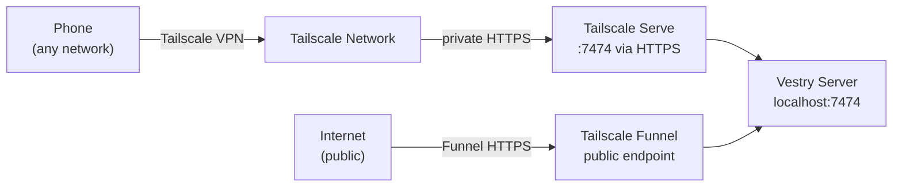

# 13 — Tailscale Integration

---

## Overview

Vestry uses Tailscale to expose the server securely across devices. Three modes:

1. **Tailscale connected** — server accessible on private Tailscale network by IP/hostname
2. **Tailscale Serve** — HTTPS on the Tailscale network (auto-cert, port routing)
3. **Tailscale Funnel** — public HTTPS accessible from the open internet

---

## TailscaleStatus

```rust
pub struct TailscaleStatus {
    pub installed: bool,
    pub connected: bool,
    pub hostname: Option<String>,
    pub ip: Option<String>,
    pub version: Option<String>,
    pub serving: bool,    // Tailscale Serve is active
    pub funnel: bool,     // Tailscale Funnel is active
}
```

---

## Startup behavior

At startup, `build_router` spawns a background task:

```rust
tokio::spawn(async move {
    let status = tailscale::get_status(server_port).await;
    // Auto-start Serve if connected but not yet serving
    let status = if status.connected && !status.serving {
        tailscale::enable_serve(server_port).await
    } else {
        status
    };
    *cache.write().await = Some((status, Instant::now()));
});
```

If Tailscale is connected but Serve is not enabled, it's auto-enabled on startup. This ensures the server is always accessible via HTTPS on the Tailscale network without manual configuration.

---

## Status caching

The `tailscale_status_cache` in `AppState` is a `TokioRwLock<Option<(TailscaleStatus, Instant)>>`. The `GET /api/tailscale/status` endpoint:

1. Reads the cache
2. If fresh (< 5 minutes): returns cached value
3. If stale or empty: calls `tailscale::get_status()` and updates cache

```rust
const CACHE_TTL: Duration = Duration::from_secs(300); // 5 minutes
```

The cache is invalidated (set to `None`) when connect/serve/funnel operations are performed so the next status read reflects the new state.

---

## Commands

The service wraps `tailscale` CLI commands:

```rust
// Check status
tokio::process::Command::new("tailscale").args(["status", "--json"]).output()

// Connect
tokio::process::Command::new("tailscale").args(["up"]).output()

// Enable Serve on port
tokio::process::Command::new("tailscale")
    .args(["serve", "--bg", &format!("https+insecure://localhost:{}", port)])
    .output()

// Enable Funnel
tokio::process::Command::new("tailscale")
    .args(["funnel", "--bg", &format!("{}", port)])
    .output()

// Disable Funnel
tokio::process::Command::new("tailscale")
    .args(["funnel", "--bg", "--off", &format!("{}", port)])
    .output()
```

---

## Frontend integration

`TailscaleSettings.tsx` and `TailscaleStatusCard.tsx` use `GET /api/tailscale/status` to display current status and provide connect/funnel toggle buttons.

The built-in `tailscale_status` agent tool (see `10-memory-system.md`) allows agents to query this information directly during a conversation — useful when helping users configure webhooks or remote access.

---

## Remote access flow



With Funnel enabled, webhooks from external services (GitHub, Stripe, etc.) can reach the server directly.
